# Military Aviation API - Class Diagram

```mermaid
classDiagram
    %% Abstract Classes
    class MilitaryVehicle {
        <<Abstract>>
        +String id
        +String designation
        +String serialNumber
        +String status
    }

    class MilitaryPersonnel {
        <<Abstract>>
        +String id
        +String name
        +String serviceNumber
        +MilitaryRank rank
    }

    class MilitaryOperation {
        <<Abstract>>
        +String id
        +String name
        +String description
        +LocalDateTime startDate
        +LocalDateTime endDate
    }

    %% Enums
    class MilitaryRank {
        <<Enum>>
        AIRMAN_BASIC
        AIRMAN
        AIRMAN_FIRST_CLASS
        SENIOR_AIRMAN
        STAFF_SERGEANT
        // ... other ranks
    }

    class AircraftStatus {
        <<Enum>>
        OPERATIONAL
        MAINTENANCE
        DEPLOYED
        RETIRED
        DAMAGED
    }

    class AircraftType {
        <<Enum>>
        FIGHTER
        BOMBER
        TRANSPORT
        RECONNAISSANCE
        HELICOPTER
    }

    class MissionType {
        <<Enum>>
        COMBAT
        RECONNAISSANCE
        TRANSPORT
        TRAINING
        RESCUE
    }

    class MissionStatus {
        <<Enum>>
        PLANNED
        IN_PROGRESS
        COMPLETED
        ABORTED
        CANCELLED
    }

    class MissionPriority {
        <<Enum>>
        LOW
        MEDIUM
        HIGH
        CRITICAL
    }

    %% Main Classes
    class Aircraft {
        +AircraftType type
        +String model
        +String manufacturer
        +int maxSpeed
        +int range
        +int serviceYear
        +AircraftStatus status
        +addMaintenance(Maintenance)
        +assignPilot(Pilot)
    }

    class Pilot {
        +int flightHours
        +AircraftType specialization
        +String licenseNumber
        +int missionsCompleted
        +PilotStatus status
        +addFlightHours(int)
        +completeMission()
    }

    class Mission {
        +MissionType missionType
        +MissionPriority priority
        +String targetLocation
        +String targetCoordinates
        +MissionStatus status
        +String objective
        +addPilot(Pilot)
        +addAircraft(Aircraft)
        +addArmament(Armament)
        +addTacticalReport(TacticalReport)
    }

    class Squadron {
        +String name
        +String designation
        +String squadronType
        +String status
        +int establishedYear
    }

    class AirBase {
        +String name
        +String location
        +String country
        +int runwayCount
        +int hangarCapacity
        +String status
    }

    class Armament {
        +String name
        +String model
        +String caliber
        +int weight
        +int range
        +String status
    }

    class Maintenance {
        +String description
        +LocalDateTime scheduledDate
        +LocalDateTime completedDate
        +String technician
        +String status
        +int estimatedHours
        +int actualHours
        +String partsReplaced
        +double cost
    }

    class TacticalReport {
        +String title
        +String content
        +LocalDateTime reportDate
        +String reporter
        +String reportType
        +String priority
        +String classification
        +String targetDetails
        +String enemyActivity
        +String weatherConditions
        +String recommendations
    }

    %% Relationships
    Aircraft "1" -- "1..*" Maintenance : has
    Aircraft "*" -- "1" Squadron : assignedTo
    Aircraft "*" -- "*" Mission : assignedTo
    Aircraft "1" -- "0..1" Pilot : pilotedBy

    Pilot "*" -- "1" Squadron : memberOf
    Pilot "0..*" -- "*" Mission : assignedTo

    Mission "1" -- "*" TacticalReport : has
    Mission "1" -- "0..1" Pilot : commandedBy
    Mission "1" -- "*" Armament : uses

    Squadron "1" -- "*" Aircraft : contains
    Squadron "1" -- "*" Pilot : has

    AirBase "1" -- "*" Squadron : hosts
    AirBase "1" -- "*" Aircraft : stationedAt

    %% Inheritance
    MilitaryVehicle <|-- Aircraft
    MilitaryPersonnel <|-- Pilot
    MilitaryOperation <|-- Mission
```



## How to View the Diagram

1. Open this file in any Markdown viewer that supports Mermaid diagrams (like VS Code with Mermaid extension)
2. Or use an online Mermaid editor (https://mermaid.live/)
3. Copy the content between the ```mermaid tags and paste it into the editor

## Key
- `+` indicates public members
- `-` indicates private members
- `#` indicates protected members
- `*` indicates a many relationship
- `1` indicates a single relationship
- `0..1` indicates an optional relationship
- `1..*` indicates one or more relationship

## Notes
- The diagram shows the main classes, enums, and their relationships
- Abstract classes are marked with `<<Abstract>>`
- Enums are marked with `<<Enum>>`
- Only the most important attributes and methods are shown for brevity
- For a complete view, refer to the actual class implementations
